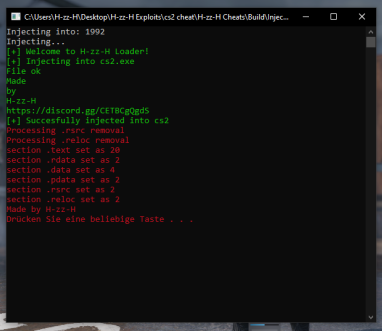

# 🚀 CS2 Manual Map Injector  

A lightweight and efficient **Manual Map DLL Injector** for **Counter-Strike 2** and other games.  
Designed for stealth and learning purposes.  

## 🛠 Features  
- ✅ **Manual Mapping** – Injects DLLs without LoadLibrary
- ✅ **Fast Process Selection** – Inject into any process instantly
- ✅ **Command-Line Usage** – No GUI, fast execution
- ✅ **Open-Source & Educational** – Easy to modify and learn

## 🚀 Usage  
1. Open **Command Prompt** (`cmd.exe`)  
2. Navigate to the injector’s folder:  
   ```sh
   cd path\to\injector
   ```
3. Run the injector with:  
   ```sh
   injector.exe yourdll.dll cs2.exe
   ```  
   - `yourdll.dll` → Path to your DLL  
   - `cs2.exe` → Target process name  

## ⚠️ Disclaimer  
- This project is for **educational purposes only**.  
- Injecting DLLs into protected processes can result in bans.  

---  
**Made for learning. Use at your own risk!**  


